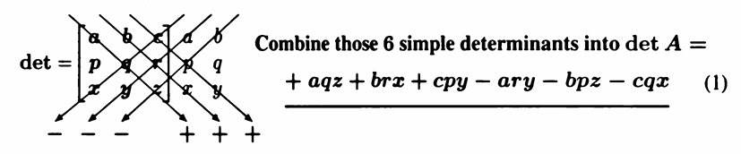
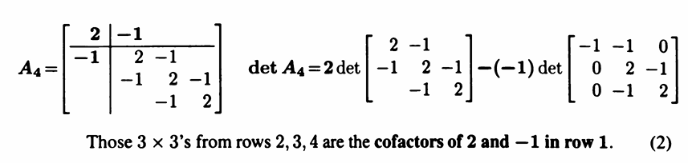

## 3 by 3 Determinants and Cofactors
$A = \begin{bmatrix} 
    a & b \\ 
    c & d 
\end{bmatrix} $ 的 determinant 是 $ad - bc$.

### 3 by 3 determinants

3 by 3 matrices 的 determinant has  $3! = 6$ 个 terms

To all determinants: **Row exchange multiplies $\det A$ by -1**

When you multiply a row by a number, **this multiplies the determinant by that number.**

For example, to 

$$
\begin{bmatrix}
    a & b & c \\
    p & q & r \\
    x & y & z
\end{bmatrix}
$$

$
\begin{bmatrix}
    a &  &  \\
     & q &  \\
     &  & z
\end{bmatrix} \rightarrow \det = +aqz
$, $
\begin{bmatrix}
     & b &  \\
    p &  &  \\
     &  & z
\end{bmatrix} \rightarrow \det = -bpz
$

第二个矩阵相当于第一个矩阵交换了第一行和第二行，所以乘了个-1

2,3,4行组成的 $3 \times 3$ 矩阵是第一行2和-1的余子式（cofactors）

### Cofactors and a Formula for $A^{-1}$

Cofactor formula $3 \times 3$ matrix:

$$
\det A = a \cdot (qz-ry) + b \cdot (rx - pz) + c \cdot (py - qx)
$$

The definition of cofactors $C_{ij}$ and the $(-1)^{i+j}$ rule for plus and minus signs:

> For the $i, j$ cofactor $C_{ij}$, remove row $i$ and column $j$ from the matrix $A$. $C_{ij}$ equals $(-1)^{i+j}$ times the determinant of the remaining matrix (size $n - 1$). **The cofactor formula along row $i$ is:**  
> $$\det A = a_{i 1} C_{i 1} + ... + a_{i n} C_{i n} \tag{1}$$
> 余子式应该是要带前面那个符号一起的

**Cofactor Matrix:**

$A = \begin{bmatrix} 
    a & b \\
    c & d  
\end{bmatrix} \rightarrow C = \begin{bmatrix}
    C_{11} = d & (-1)^{1+2}C_{12} = -b \\
    (-1)^{2+1}C_{21} = -c & C_{22} = a
\end{bmatrix} \quad \text{(Cofactor Matrix)}$

Notice:

$$
AC^{T} = \begin{bmatrix} 
    ad - bc & 0 \\
    0 & ad - bc
\end{bmatrix} = \begin{bmatrix} 
    \det A & 0 \\
    0 & \det A
\end{bmatrix} = (\det A) I 
$$ 

**Inverse matrix formula:** 

$$
A^{-1} = \frac{1}{\det A} C^{T}
$$

$C^{T}$ is **adjugate matrix(伴随矩阵)**

$AC^{T}$ 的diagonal entries 是 $\det A$，即 $(1)$ 式所示

### The $-1, 2, -1$ Tridiagonal Matrix

$-1, 2, -1$矩阵 $A_n$:

$$
\det \begin{bmatrix} 
    2 & -1 & 0 & 0 & 0 \\
    -1 & 2 & -1 & 0 & 0 \\
    0 & -1 & 2 & -1 & 0 \\
    0 & 0 & -1 & 2 & -1 \\
    \cdot & \cdot & \cdot & \cdot & \cdot
\end{bmatrix} = 2 (-1)^{1+1} \det \begin{bmatrix} 
    2 & -1 & 0 & 0 \\
    -1 & 2 & -1 & 0\\
    0 & -1 & 2 & -1 \\
    \cdot & \cdot & \cdot & \cdot
\end{bmatrix} + (-1) \cdot (-1)^{1 + 2} \det \begin{bmatrix}
    -1 & -1 & 0 & 0 \\
    0 & 2 & -1 & 0 \\
    0 & -1 & 2 & -1 \\
    \cdot & \cdot & \cdot & \cdot
\end{bmatrix}
$$

右边第一项可以写成 $2 \det A_{n-1}$

最右边那个矩阵按第一列用余子式展开，因为第一列只有一个1，所以第二项直接变成：

$$
(-1) \cdot (-1)^{1+2} \cdot (-1) \cdot (-1)^{1 + 1} \det A_{n-2} = - \det A_{n-2}
$$

所以最终结果：

$$
\det A_n = 2 \det A_{n-1} - \det A_{n-2}
$$

## Computing and Using Determinants

For **Triangular and Diagonal Matrix**:

$$
\det \begin{bmatrix} 
    a & b & c \\
      & q & r \\
      &  & z
\end{bmatrix} = \det \begin{bmatrix} 
    a &  &  \\
      & q &  \\
      &  & z
\end{bmatrix} = a \cdot q \cdot z
$$

**Transpose:** 

$$\det(A^{T}) = \det(A)$$

**Multiply two matrices:**

$$
\det(AB) = \det(A) \cdot \det(B)
$$

*Proof:*

引理1:

任意一个 n 阶可逆方阵 $A$（非奇异阵），都可以表示为有限个初等矩阵的乘积。

*Proof:*

设 $A$ 为 $n \times n$ 的非奇异阵，可使用初等行变换将 $A$ 化为单位阵 $I_{n}$:

$$
P_mP_{m-1} \cdots P_1 A = I_{n} \rightarrow A = P_1^{-1}P_2^{-1} \cdots P_m^{-1} I_{n} = P_1^{-1}P_2^{-1} \cdots P_m^{-1} \quad (\text{(都是初等阵)})
$$

证毕

初等矩阵是通过对 $n \times n$ 单位矩阵 $I_n$ 施加一次初等行变换（或列变换）得到的矩阵。初等行变换包括以下三种类型：

$$
\text{初等矩阵}\begin{cases} \text{行交换：交换第}i,j\text{行，行列式变号},  & \det E = -1  \\ \text{行缩放：第}i\text{行缩放}k\text{倍}, & \det E = k \\ \text{行加减：不改变行列式的值}, & \det E = 1 \end{cases}
$$

若 $A$ 可逆：

设 $A = E_1E_2\cdots E_k$

$$
\det (AB) = \det(E_1E_2\cdots E_kB) = \det(E_1)\det(E_2)\cdots \det(E_k)\det(B) = \det(E_1E_2\cdots E_k)\det(B) = \det(A)\det(B)
$$

因为初等矩阵行列式的乘积等于乘积的行列式（枚举即可）

证毕

**Orthogonal matrices $Q$ have determinant 1 or -1**

*Proof:*

Let $Q$ be an orthogonal matrix, then $Q^{T}Q = I$. Taking determinants on both sides:

$$
\det(Q^{T}Q) = \det(I) = 1
$$

Using the property of determinants:

$$
\det(Q^{T})\det(Q) = 1
$$

Since $\det(Q^{T}) = \det(Q)$, we have:

$$
\det(Q)^{2} = 1 \implies \det(Q) = \pm 1
$$

**Invertible matrices have $\det A = \pm (\text{product of the pivots})$**

If $A = LU$, then $\det A = (\det L)(\det U) = \det U$, 因为 $L$ 是下三角矩阵，且对角线上的元素都是1，所以 $\det L = 1$. $U$ 是上三角矩阵，所以就直接 multiply the pivots就好

If $PA = LU$ because of row exchanges, then $\det P = \pm 1$. 因为 $P$ 是通过交换行得到的(permutation matrix)，所以它的行列式是 $\pm 1$.

所以 Elimination是Computer System求解 行列式的方法

**Three Simple Properties of Determinants:**

I. The $n$ by $n$ identity matrix has $\det I = 1$

II. Exchanging two rows of $A$ reverses $\det A$ to $-\det A$

III. If row 1 of $A$ is a combination $c \boldsymbol{v} + d \boldsymbol{w}$, then add 2 determinants:

$$
\det \begin{bmatrix} 
    c \boldsymbol{v} + d \boldsymbol{w} \\
    \text{row }2 \\
    \cdots \\
    \text{row }n
\end{bmatrix} = c \det \begin{bmatrix} 
    \boldsymbol{v} \\
    \text{row }2 \\
    \cdots \\
    \text{row }n
\end{bmatrix} + d \det \begin{bmatrix} 
    \boldsymbol{w} \\
    \text{row }2 \\
    \cdots \\
    \text{row }n
\end{bmatrix}
$$

Property II leads to a simple fact: 

If A has **two equal rows, its determinant is zero**. 

Exchanging the rows has no effect on $A$. Then $\det A = - \det A$ forces $\det A = 0$. 

Now use rule III: Subtracting $d$ times row $i$ from row $j$ leaves $\det A$ unchanged.

$$
\det \begin{bmatrix} 
    \text{row }1 \\
    \text{row }2-d \text{row }1 \\
    \cdots \\
    \text{row }n
\end{bmatrix}  = \det \begin{bmatrix} 
    \text{row }1 \\
    \text{row }2 \\
    \cdots \\
    \text{row }n
\end{bmatrix} - d \det \begin{bmatrix} 
    \text{row }1 \\
    \text{row }1 \\
    \cdots \\
    \text{row }n
\end{bmatrix}= \det A
$$

So, the elimination (without row exchanges) is the way to simplify $A$ and its determinant.

No row exchange:

$$
\det A = \det U = U_{11} U_{22} \cdots U_{nn} = \text{product of the pivots}
$$

注意：$\det (A + B) \neq \det A + \det B$

### Cramer's Rule to Solve $A x = b$

If $A$ is invertible($\det A \neq 0$), then the solution to $A x = b$ is given by:

$$
x_i = \frac{\det(B_i)}{\det(A)}
$$

where $B_j$ is the matrix obtained by replacing the $j$-th column of $A$ with the vector $b$.

*Proof:*

Key Idea:

$$
\begin{bmatrix} 
    A 
\end{bmatrix} \cdot \begin{bmatrix} 
    x_1 & 0 & 0 \\ 
    x_2 & 1 & 0 \\ 
    x_3 & 0 & 1
\end{bmatrix} = \begin{bmatrix} 
    b_1 & a_{12} & a_{13} \\
    b_2 & a_{22} & a_{23} \\
    b_3 & a_{32} & a_{33}
\end{bmatrix} = B_1
$$

Thus: 

$$
\det A \cdot \det \begin{bmatrix} 
    x_1 & 0 & 0 \\ 
    x_2 & 1 & 0 \\ 
    x_3 & 0 & 1
\end{bmatrix}(= x_1 \because \text{determinant of a triangular matrix}) = \det B_1
$$

$$
\det A \cdot x_1 = \det B_1 \rightarrow x_1 = \frac{\det B_1}{\det A}
$$

In the same way:

$$
\det A \cdot \det \begin{bmatrix} 
    1 & x_1 & 0 \\ 
    0 & x_2 & 0 \\ 
    0 & x_3 & 1
\end{bmatrix}(= x_2 \because \text{elimination and determinant of a triangular matrix}) = \det B_2
$$

$$
\det A \cdot x_2 = \det B_2 \rightarrow x_2 = \frac{\det B_2}{\det A}
$$

And so on.

