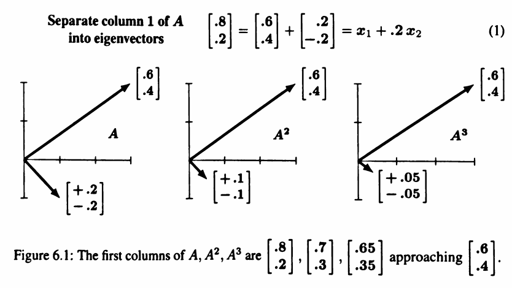
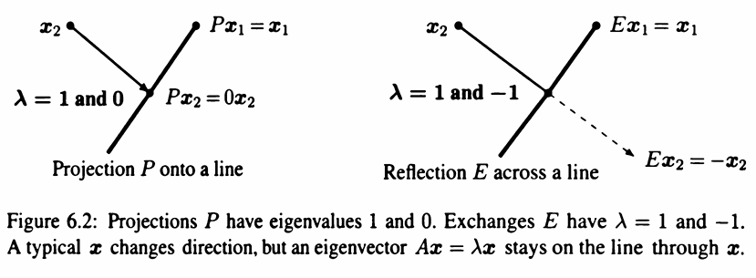
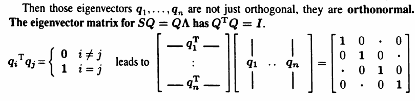

## Introduction to Eigenvalues: $Ax = \lambda x$

**"eigenvectors" $x$ don't change direction when you multiply by $A$.**

**Certain exceptional vectors $x$ are in the same direction as $Ax$. Those are the “eigenvectors”**, and they satisfy the equation:

$$
Ax = \lambda x
$$

where $\lambda$ is an **eigenvalue** of $A$.

If $A$ is the identity matrix, then:

every vector has $A x = x$, all vectors are eigenvectors of $I$.

The eigenvectors of $A$ remain eigenvectors of $A^2$, The eigenvalues $\lambda$ are squared:

$$
A^{2}x = A(Ax) = A(\lambda x) = \lambda (Ax) = \lambda^{2} x
$$

对于n次方也一样：

An eigenvector $x$ of A is also an eigenvector of every $A^n$, Then $A^n x = \lambda^n x$.

**Example 1**

$$
A = \begin{bmatrix}
.8 & .3 \\
.2 & .7
\end{bmatrix} \rightarrow \det \begin{bmatrix} 
    .8-\lambda & .3 \\
    .2 & .7-\lambda
\end{bmatrix}  = \lambda^{2} - \frac{3}{2}\lambda + \frac{1}{2} = (\lambda - 1)(\lambda - \frac{1}{2})
$$

Two eigenvalues:

$$
\lambda_1 = 1, \quad \lambda_2 = \frac{1}{2}
$$

Thus,

$$
(A - I)\boldsymbol{x_1} = 0 \rightarrow A \boldsymbol{x_1} = \boldsymbol{x_1} \rightarrow \boldsymbol{x_1} = \begin{bmatrix}
.6 \\
.4
\end{bmatrix}
$$

$$
(A - \frac{1}{2}I)\boldsymbol{x_2} = 0 \rightarrow A \boldsymbol{x_2} = \frac{1}{2} \boldsymbol{x_2} \rightarrow \boldsymbol{x_2} = \begin{bmatrix}
1 \\
-1
\end{bmatrix}
$$

All other vectors are combinations of the two eigenvectors $\boldsymbol{x_1}$ and $\boldsymbol{x_2}$

Multiply each $x_i$ by $\lambda_i$ for column 1 of $A^{2}$:

$$
A \begin{bmatrix} 
    .8 \\
    .2 
\end{bmatrix} \rightarrow \boldsymbol{x_1} + \frac{1}{2} (.2) \boldsymbol{x_2} = \begin{bmatrix} 
    .6 \\
    .4
\end{bmatrix} + \begin{bmatrix} 
    .1 \\
    -.1
\end{bmatrix} = \begin{bmatrix} 
    .7 \\
    .3
\end{bmatrix}
$$

**Each eigenvector is multiplied by its eigenvalue**

Column 1 of $A^{100}$: 

$$
A^{99}\begin{bmatrix} 
    .8 \\ 
    .2
\end{bmatrix} \rightarrow \boldsymbol{x_1} + (.2) (\frac{1}{2})^{99} \boldsymbol{x_2} = \begin{bmatrix} 
    .6 \\
    .4 
\end{bmatrix} + \begin{bmatrix} 
    \text{very small} \\
    \text{vector}
\end{bmatrix} 
$$

$A$ 被叫做 **Markov matrix**，最大的eigenvalue $\lambda=1$， $\boldsymbol{x_1} = (.6, .4)$是steady state: $A^{k}$的所有列都将趋近于这个值

**Example 2**

**The projection matrix** $P = \begin{bmatrix} 
    .5 & .5 \\
    .5 & .5
\end{bmatrix} $ has eigenvalues $\lambda=1$ and $\lambda=0$.

eigenvectors: $\boldsymbol{x_1} = \begin{bmatrix} 1 \\ 1 \end{bmatrix}$ and $\boldsymbol{x_2} = \begin{bmatrix} 1 \\ -1 \end{bmatrix}$.

Thus, $P \boldsymbol{x_1} = \boldsymbol{x_1}$(steady state) and $P \boldsymbol{x_2} = 0$(nullspace).

Properties:

1. **Markov matrix:** Each column of $P$ adds to 1. Then $\lambda = 1$ is an eigenvalue.
2. **$P$ is a singular matrix.** $\lambda = 0$ is an eigenvalue.
3. **$P = P^T$ is a symmetric matrix.** Perpendicular eigenvectors $\boldsymbol{x_1}$ and $\boldsymbol{x_2}$.

"投影":

Project each part $\boldsymbol{v} = \begin{bmatrix} 
    1 \\ -1 
\end{bmatrix} + \begin{bmatrix} 
    2 \\ 2 
\end{bmatrix} = \begin{bmatrix} 
    3 \\ 1 
\end{bmatrix}   $ onto: $P \boldsymbol{v} = \begin{bmatrix} 
    0 \\ 0 
\end{bmatrix} + \begin{bmatrix} 
    2 \\ 2 
\end{bmatrix}  $

**Projections have $\lambda=0$ and $1$; Permutations have all $|\lambda|=1$.**

**Example 3**

**The exchange matrix** $E = \begin{bmatrix} 
    0 & 1 \\
    1 & 0
\end{bmatrix}$ has eigenvalues $\lambda=1$ and $\lambda=-1$.

eigenvectors: $\boldsymbol{x_1} = \begin{bmatrix} 1 \\ 1 \end{bmatrix}$ and $\boldsymbol{x_2} = \begin{bmatrix} 1 \\ -1 \end{bmatrix}$.

$\boldsymbol{x_1}$ is unchanged by $E$. $\boldsymbol{x_2}$ signs are reversed by $E$.

可以发现： 一个没有负项的矩阵仍然可以有负的特征值。

同时，The eigenvectors for E are the same as for P,because $E=2P-I$.

$$
E = 2P - I \rightarrow \begin{bmatrix} 
    0 & 1\\
    1 & 0 
\end{bmatrix} = 2 \begin{bmatrix} 
    .5 & .5 \\
    .5 & .5
\end{bmatrix} - \begin{bmatrix} 
    1 & 0 \\
    0 & 1
\end{bmatrix}
$$

**When a matrix is shifted by $I$, each $λ$ is shifted by $1$. No change in the eigenvectors.**

### Equation: $\det (A - \lambda I) =0$

$A \boldsymbol{x} = \lambda \boldsymbol{x} \rightarrow (A - \lambda I) \boldsymbol{x} = 0$

Eigenvalues: The number $λ$ is an eigenvalue of $A$ if and only if $A - λI$ is singular.
Equation for the $n$ eigenvalues of : $$\det(A - \lambda I) = 0 \tag{2}$$.

$A - \lambda I$的所有对角元素都有 $\lambda$，所以 $(2)$ 中有 $(-\lambda)^{n}$, 所以就应该有 $n$个解，**$A$ 有 $n$ 个特征值**

**An $n$ by $n$ matrix has $n$ eigenvalues (repeated $\lambda$'s are possible).**

**Summary:**

To solve the eigenvalue problem for an $n$ by $n$ matrix, follow these steps :
1. **Compute the determinant of $A - \lambda I$**. 
   1. With $\lambda$ subtracted along the diagonal, this determinant starts with $A$ or $-A$, It is a polynomial in $\lambda$ of degree $n$. 
2. **Find the roots of this polynomial**, by solving $\det(A - \lambda I) = 0$. The $n$ roots are the $n$ eigenvalues of $A$. They make $A - \lambda I$ singular.
3. For each eigenvalue $\lambda$, **solve $(A- \lambda I) \boldsymbol{x} = 0$ to find an eigenvector $\boldsymbol{x}$**.

一般来说，特征向量是一条线，只是取线上的任意一段作为特征向量。

### Determinant and Trace

If you add a row of $A$ to another row, or exchange rows, **the eigenvalues usually change**. 

Elimination does not preserve the $λ$'s. The triangular U has its eigenvalues sitting along the diagonal-**they are the pivots. But they are not the eigenvalues of $A$!** Eigenvalues are changed when row 1 is added to row 2:

> The product $(\lambda_1)(\lambda_2) \cdots (\lambda_n)$ of the $n$ eigenvalues = $\det(A)$ is the determinant of $A$.
> $\lambda_1+ \lambda_2 + \cdots + \lambda_n = \text{The sum of the diagonal entries} = \text{tr}(A)$ is the trace of $A$.

### Imaginary Eigenvalues(虚特征值)

90° rotation matrix $Q = \begin{bmatrix} 
    0 & -1 \\
    1 & 0
\end{bmatrix} $ has no real eigenvalues.

Its eigenvalues are $\lambda = i$ and $\lambda = -i$, which are purely imaginary.

Complex eigenvectors: $\boldsymbol{x_1} = \begin{bmatrix} i \\ 1 \end{bmatrix}$ and $\boldsymbol{x_2} = \begin{bmatrix} 1 \\ i \end{bmatrix}$.

$Q$ 的两个properties:

- $Q$ is an orthogonal matrix $\rightarrow $ The absolute value of each $\lambda$ is $|\lambda| = 1$
- $Q$ is a skew-symmetric matrix $\rightarrow Q^T = -Q$, so each $\lambda$ is purely imaginary.

Eigenvectors for all these special matrices (对称矩阵 $S^{T} = S$，skew-symmetric矩阵 $Q^{T} = -Q$，orthogonal matrix: $Q^{T}Q=I$) are perpendicular.

## Diagonalizing a Matrix

## Symmetric Positive Definite matrices

对于对称矩阵 $S = S^{T}$:

1. All $n$ eigenvalues $\lambda$ of a symmetric matrix $S$ are real numbers.
2. The $n$ eigenvectors $q$ can be chosen orthogonal(perpendicular to each other).

